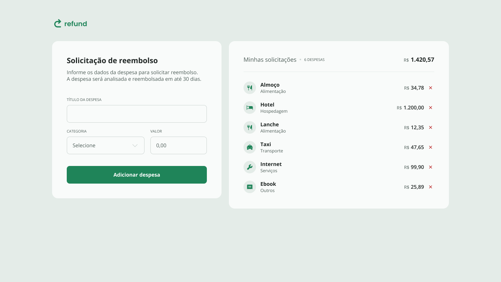

# 💰 Refund — Controle Simples de Reembolso

**Refund** é uma aplicação web focada em **organizar e acompanhar reembolso de forma prática e visual**. O projeto permite registrar gastos, categorizá-los e acompanhar **quantidade total** e **valor acumulado**, oferecendo uma visão clara do controle financeiro diário.

A proposta central é unir **simplicidade**, **boa experiência de uso** e **lógica financeira correta**, sendo ideal tanto para uso pessoal quanto como projeto de estudo em JavaScript e manipulação do DOM.

---

## 🧭 Sobre a Aplicação

A aplicação foi desenvolvida com foco em **clareza e usabilidade**, permitindo que o usuário registre despesas rapidamente, sem fluxos complexos ou excesso de informações.

O layout prioriza:
- **Hierarquia visual clara**
- **Feedback imediato** ao adicionar ou remover despesas
- **Formatação monetária correta (BRL – pt-BR)**

Todo o comportamento da aplicação é controlado via **JavaScript puro**, sem dependências externas.

---

## 📋 O que a Aplicação Permite

- 🧾 **Cadastrar despesas** com nome, categoria e valor  
- 🗂️ **Classificar despesas por categoria**, com ícones visuais  
- ➕ **Adicionar despesas dinamicamente** à lista  
- ❌ **Remover despesas individualmente**  
- 🔢 **Exibir quantidade total de despesas**  
- 💵 **Calcular e atualizar automaticamente o valor total gasto**  

---

